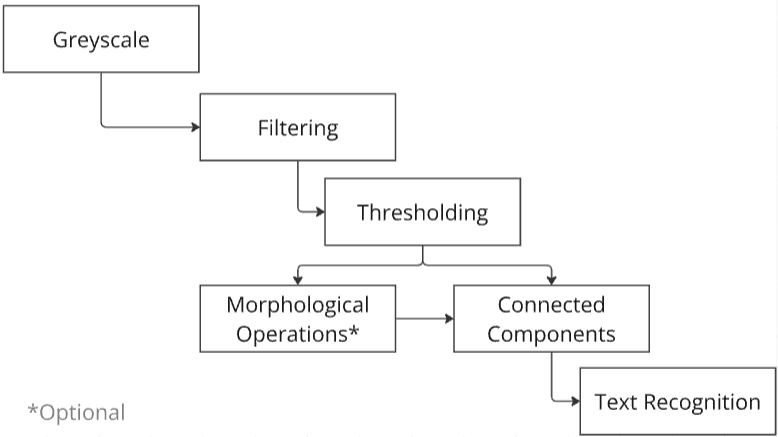
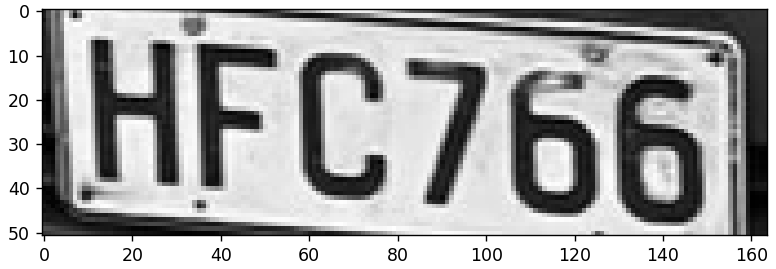
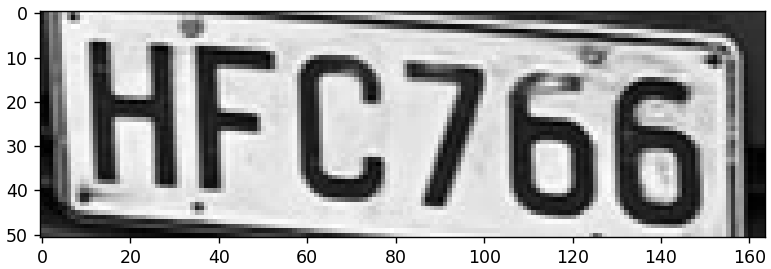
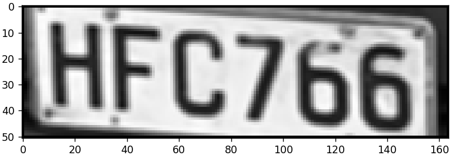
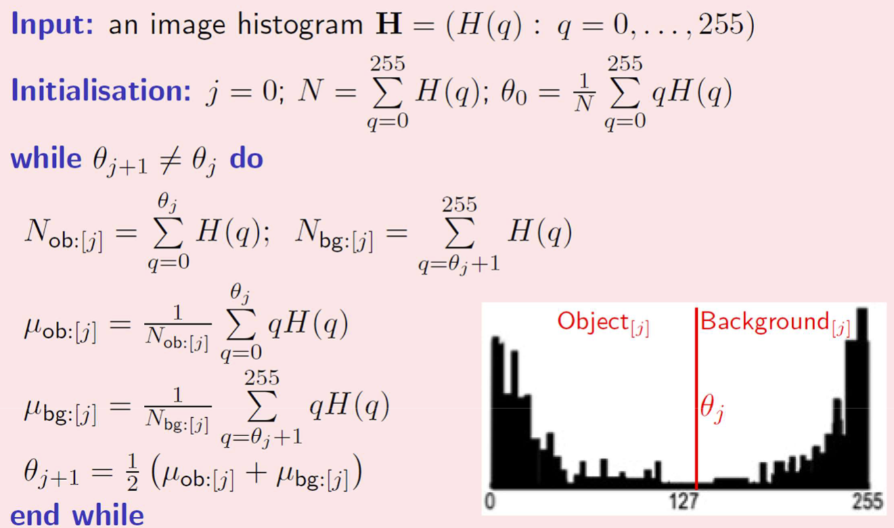
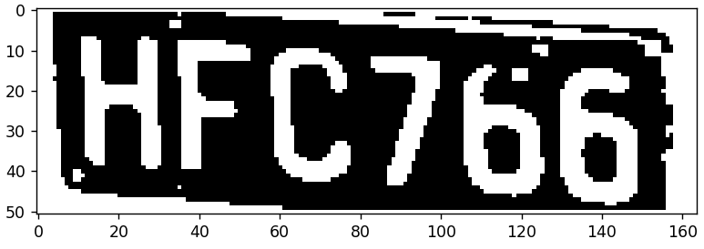
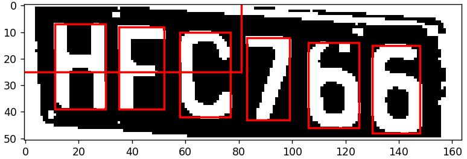

###### Created by: Eason Jin
# DEVS Computer Vision Workshop 2025
[Slides](https://www.canva.com/design/DAGdRk4ZUc4/JaaPwtJ6gFl2kgXO0jr1zQ/edit)
## Introduction
This workshop is designed to introduce the basics of computer vision and its applications. We will go through each stage of the image processing pipeline by implementing a simple car number plate detection program.\
\
To get the full experience of image processing and object detection, we are going to implement everything from scratch. We could use libraries like OpenCV, but we are not going to 🙂.
## Prerequisites
Okay, that was a lie. We are actually using these libraries listed below. But don't worry, they do not directly impact the image processing part.\
\
First of all, make sure you have Python installed on your computer. You can download it from [here](https://www.python.org/downloads/). I am using Python 3.11.3, but any version above (including) 3.9 should work.
- Numpy for array operations
```bash	
pip install numpy
```
- Matplotlib for debug and visualization
```bash
pip install matplotlib
```
- PIL for image loading
```bash
pip install pillow
```
That's it! We are ready to process some images.
## Image Processing Pipeline
We are going to follow this simple pipeline. Content derived from part II of [COMPSCI 373](https://courseoutline.auckland.ac.nz/dco/course/COMPSCI/373), but not exactly the same.

### 0. Import Libraries
Let's start by importing the libraries we need. Utils.py contains bitmaps of the characters we are going to detect.
```python
from PIL import Image
import numpy as np
from matplotlib import pyplot
from matplotlib.patches import Rectangle
import Utils
```
We are going to define some general functions that we will use later.\
\
This function creates a blank image (2D array) with the specified height and width.
```python
def createCanvas(height: int, width: int) -> np.ndarray:
    return np.zeros((height, width), dtype=np.uint8)
```
This function displays the image (and bounding boxes) using matplotlib.
```python
def showImage(image: np.ndarray, boxes=None) -> None:
    fig, axs = pyplot.subplots(1, 1)
    axs.imshow(image, aspect="equal")
    if boxes is not None:
        for bounding_box in boxes:
            # Bounding boxes will appear as red rectangles
            bbox_min_x = bounding_box[0]
            bbox_min_y = bounding_box[1]
            bbox_max_x = bounding_box[2]
            bbox_max_y = bounding_box[3]

            bbox_xy = (bbox_min_x, bbox_min_y)
            bbox_width = bbox_max_x - bbox_min_x
            bbox_height = bbox_max_y - bbox_min_y
            rect = Rectangle(
                bbox_xy,
                bbox_width,
                bbox_height,
                linewidth=2,
                edgecolor="r",
                facecolor="none",
            )
            axs.add_patch(rect)
    pyplot.tight_layout()
    pyplot.imshow(image, cmap="gray", aspect="equal")
    pyplot.show()
```
### 1. Load Image
First, we need to load an image. We are going to use the PIL library to load the image.
```python
def readImage(path: str) -> np.ndarray:
    image = Image.open(path)
    image = image.convert("RGB")
    return np.array(image)
```
This returns us a 3D numpy array of size width \* height \* 3. The 3 channels are Red, Green, and Blue.

### 2. Convert to Grayscale
Next, we need to convert the image to grayscale. We can do this by taking a certain ratio of the RGB values. This is because the human eye doesn't actually perceive colors equally. The eye is most sensitive to green, followed by red, and then blue ([Source](https://www.itu.int/dms_pubrec/itu-r/rec/bt/R-REC-BT.709-4-200003-S%21%21PDF-E.pdf)).
```python
def rgbToGreyscale(image: np.ndarray) -> np.ndarray:
    height, width = image.shape[:2]
    greyscale = createCanvas(height, width)
    for h in range(height):
        for w in range(width):
            greyscale[h, w] = image[h, w, 0] * 0.299 + \
                image[h, w, 1] * 0.587 + image[h, w, 2] * 0.114
    return greyscale
```
Or if you are a Numpy expert, just do this:
```python
def rgbToGreyscale(image: np.ndarray) -> np.ndarray:
    return np.dot(image[..., :3], [0.299, 0.587, 0.114])
```
If we output the image now, it should look something like this:



### 3. Stretch the contrast
To enhance the contrast of the image, we can stretch the histogram of the image. This can be done by scaling the pixel values so that the minimum value in the image maps to 0 and the maximum value maps to 255, thereby increasing the dynamic range of intensities.
```python
def stretchContrast(image: np.ndarray) -> np.ndarray:
    height, width = image.shape[:2]
    stretched = createCanvas(height, width)
    min_value = np.min(image)
    max_value = np.max(image)
    for h in range(height):
        for w in range(width):
            stretched[h, w] = (image[h, w] - min_value) * \
                255 / (max_value - min_value)
    return stretched
```
The image does not look too different from the greyscale image because the image already have strong contrast between white text and black background.



### 4. Apply Mean Filter
To reduce noise in the image, we can apply a mean filter. This is done by taking the average of the pixel values in a 3x3 window around each pixel.
```python
def meanFilter(image: np.ndarray) -> np.ndarray:
    height, width = image.shape[:2]
    filtered = createCanvas(height, width)

    WINDOW_SIZE = 3

    filtered = createCanvas(height, width)
    window_half = WINDOW_SIZE // 2

    for row in range(window_half, height - window_half):
        for col in range(window_half, width - window_half):
            result = 0
            for i in range(-window_half, window_half+1):
                for j in range(-window_half, window_half+1):
                    result += image[row + i, col + j]
            filtered[row, col] = abs(float(result / WINDOW_SIZE**2))

    return filtered
```
To do it faster with Numpy:
```python
def meanFilter(image: np.ndarray) -> np.ndarray:
    WINDOW_SIZE = 3
    window_half = WINDOW_SIZE // 2

    return np.mean(
        np.pad(image, window_half, mode="edge")[..., None, None] * np.ones((WINDOW_SIZE, WINDOW_SIZE)) / (WINDOW_SIZE ** 2),
        axis=(2, 3),
    )

```
We can see that the image is blurred. This essentially removes small "salt and pepper" noise in the image. This blurring step can be repeated multiple times to further reduce noise.


### 5. Apply Threshold
To binarize the image, we can apply a threshold. This is done by setting the pixel value to 255 if it is less than the threshold, and 0 otherwise. This creates a black background and a white foreground.\
This is a simple thresholding method that takes in a pre-defined threshold value.
```python
def simpleThreshold(image: np.ndarray, theta: int) -> np.ndarray:
    height, width = image.shape[:2]
    thresh = createCanvas(height, width)

    for row in range(height):
        for col in range(width):
            if image[row, col] < theta:
                thresh[row, col] = 255
            else:
                thresh[row, col] = 0

    return thresh
```
Alternatively, we can use this adaptive thresholding method to automatically determine the threshold value.

*Image taken from COMPSCI 373 course book.
```python
def adaptiveThreshold(image: np.ndarray) -> np.ndarray:
    # Get the image dimensions
    height, width = image.shape

    # Create the histogram (using numpy)
    hist, bins = np.histogram(image.flatten(), bins=256, range=(0, 256))

    # Calculate N and theta0
    N = hist.cumsum()[-1]  # Total number of pixels
    theta = np.sum(np.arange(256) * hist) / N  # Initial theta

    # Calculate Nob and Nbg
    Nob = np.sum(hist[:round(theta)])
    Nbg = np.sum(hist[round(theta):])

    # Calculate uob and ubg
    uob = np.sum(np.arange(round(theta)) *
                 hist[:round(theta)]) / Nob if Nob > 0 else 0
    ubg = np.sum(np.arange(round(theta), 256) *
                 hist[round(theta):]) / Nbg if Nbg > 0 else 0

    # Find theta j+1
    thetaNext = (uob + ubg) / 2
    # Iteration loop until convergence
    while abs(theta - thetaNext) > 1e-5:  # Set a small tolerance for convergence
        theta = thetaNext
        Nob = np.sum(hist[:round(theta)])
        Nbg = np.sum(hist[round(theta):])
        uob = np.sum(np.arange(round(theta)) *
                     hist[:round(theta)]) / Nob if Nob > 0 else 0
        ubg = np.sum(np.arange(round(theta), 256) *
                     hist[round(theta):]) / Nbg if Nbg > 0 else 0
        thetaNext = (uob + ubg) / 2

    # Apply the threshold using the calculated theta
    thresh = simpleThreshold(image, theta)
    return thresh
```
We can see that the image is now black and white only:



### 6. Find Connected Components
To find connected components in the image, we can use a breadth-first search (BFS) algorithm. Although depth-first search (DFS) should yield you the same results. This algorithm starts at a pixel and explores adjacent pixels as far as possible along each branch before backtracking and finds the next component.\
\
To eliminate small noise, we can set a minimum size for the connected components.
```python
def connectedComponents(image: np.ndarray) -> list:
    components = []
    height, width = image.shape[:2]
    visited = createCanvas(height, width)
    queue = []

    for row in range(height):
        for col in range(width):
            if not visited[row, col] and image[row, col] != 0:
                queue.append((row, col))
                visited[row, col] = 1
                min_x, min_y, max_x, max_y = col, row, 0, 0

                # BFS, enqueue if pixel not 0 and not visited
                while queue:
                    row, col = queue.pop(0)
                    min_x = min(min_x, col)
                    min_y = min(min_y, row)
                    max_x = max(max_x, col)
                    max_y = max(max_y, row)

                    # Left
                    try:
                        if visited[row, col-1] == 0 and image[row, col-1] != 0:
                            queue.append((row, col-1))
                            visited[row, col-1] = 1
                    except IndexError:
                        pass

                    # Right
                    try:
                        if visited[row, col+1] == 0 and image[row, col+1] != 0:
                            queue.append((row, col+1))
                            visited[row, col+1] = 1
                    except IndexError:
                        pass

                    # Up
                    try:
                        if visited[row-1, col] == 0 and image[row-1, col] != 0:
                            queue.append((row-1, col))
                            visited[row-1, col] = 1
                    except IndexError:
                        pass

                    # Down
                    try:
                        if visited[row+1, col] == 0 and image[row+1, col] != 0:
                            queue.append((row+1, col))
                            visited[row+1, col] = 1
                    except IndexError:
                        pass

                diameter_x = max_x-min_x
                diameter_y = max_y-min_y
                # Minimum size threshold to filter out little noise
                threshold_size = 10
                if diameter_x < threshold_size and diameter_y < threshold_size:
                    pass
                else:
                    components.append((min_x, min_y, max_x, max_y))
    components.sort(key=lambda x: x[0])  # Order boxes by min_x
    return components
```
The x and y coordinates of each component creates a bounding box around the object we are trying to detect. We can use them to segment the image and only keep the regions of interest.
```python
def getComponents(image: np.ndarray, boxes: list) -> list:
    components = []
    for box in boxes:
        min_x, min_y, max_x, max_y = box
        component = image[min_y:max_y, min_x:max_x]
        if len(component) != 0:
            components.append(component)
    return components
```
We can see each character is encircled by a bounding box. There is a artifact at the top left corner, however it will be ignored in the following steps and does not affect the result.



### 7. Character Recognition
To recognize the characters in the image, we can use a simple template (found in Utils.py) matching algorithm. This algorithm compares the template image with the characters in the image and finds the best match.\
\
We are going to use the SSIM (Structural Similarity Index) to compare the template with the characters in the image. The SSIM is a metric that measures the similarity between two images.\
\
Before doing that, we need to resize the template to match the size of the characters in the image.

```python
def resizeImage(bitmap: np.ndarray, new_height: int, new_width: int) -> np.ndarray:
    old_height, old_width = bitmap.shape
    resized_bitmap = np.zeros((new_height, new_width), dtype=bitmap.dtype)
    for i in range(new_height):
        for j in range(new_width):
            old_i = int(i * old_height / new_height)
            old_j = int(j * old_width / new_width)
            resized_bitmap[i, j] = bitmap[old_i, old_j]
    return resized_bitmap
```
Now we can calculate the SSIM between the template and the characters in the image.
```python
def computeSSIM(bitmap1: np.ndarray, bitmap2: np.ndarray) -> float:
    mean1, mean2 = np.mean(bitmap1), np.mean(bitmap2)
    var1, var2 = np.var(bitmap1), np.var(bitmap2)
    cov = np.mean((bitmap1 - mean1) * (bitmap2 - mean2))
    c1, c2 = 0.01**2, 0.03**2
    return ((2 * mean1 * mean2 + c1) * (2 * cov + c2)) / ((mean1**2 + mean2**2 + c1) * (var1 + var2 + c2))


def compareImages(bitmap1: np.ndarray, bitmap2: list) -> float:
    bitmap2 = np.asarray(bitmap2, dtype=np.uint8)
    resized_bitmap2 = resizeImage(
        bitmap2, bitmap1.shape[0], bitmap1.shape[1])
    return computeSSIM(bitmap1, resized_bitmap2)
```
### 8. Compare Against Each Template
Now we can compare the characters in the image against each template and take the best 3. The result yields extremely small values because the two images are very different. However this is good enough since we only need the best 3 out of them. \
\
The SSIM result is multiplied by magic number 1000000 to make it easier to read.
```python
def matchLetter(component: np.ndarray) -> list:
    global templates
    height, width = component.shape
    results = []
    for letter, bitmap in templates.items():
        matchRate = compareImages(component, bitmap)
        # Wow magic number 😲
        results.append((letter, round(matchRate*1000000, 2)))
    # Sort the results by matchRate and take the first 3
    results.sort(key=lambda x: x[1], reverse=True)
    print(results[:3])
    return results[:3]
```
### 9. Putting It All Together
Now we can put all the functions in sequence to process the image.
```python
if __name__ == "__main__":
    templates = Utils.TEMPLATES
    image = readImage("images/1.jpg")
    image = rgbToGreyscale(image)
    image = stretchContrast(image)
    image = meanFilter(image)
    image = adaptiveThreshold(image)
    boxes = connectedComponents(image)
    components = getComponents(image, boxes)
    for component in components:
        matchLetter(component)
```
The terminal should output the following:
```
[('H', 55.42), ('M', 46.67), ('N', 34.12)]
[('F', 56.57), ('R', 42.84), ('P', 42.38)]
[('C', 56.7), ('G', 48.76), ('O', 46.71)]
[('7', 56.71), ('V', 25.88), ('Z', 25.17)]
[('6', 44.22), ('G', 31.32), ('5', 31.19)]
[('6', 49.54), ('G', 37.94), ('5', 36.27)]
```
Comparing the most likely outputs to the image, we can see that the number plate is indeed HFC766.


### 10. Conclusion
Due to various aspects like lighting, noise, and image quality, the results may not be always correct. For example, image 3 is NO4847 instead of the most likely output NO484Z. 


However, we do see 7 appearing as the 2nd most likely output of the last character.
```
[('N', 51.75), ('H', 30.64), ('M', 29.93)]
[('O', 47.59), ('Q', 37.56), ('D', 32.84)]
[('4', 46.7), ('A', 18.06), ('8', 11.81)]
[('8', 34.91), ('6', 30.58), ('B', 27.99)]
[('4', 48.73), ('A', 19.01), ('8', 12.35)]
[('Z', 50.28), ('7', 41.47), ('T', 35.25)]
```
But this is the basic idea of how we can detect and recognize objects in an image using computer vision. Feel free to try out other examples.

### 11. Extension (Morphological Operations)
To further improve the accuracy of the character recognition, we can apply morphological operations to the image. This is done by applying a series of operations like dilation, erosion, opening, and closing to the image.
#### Dilation
Dilation is used to expand the boundaries of the objects in the image. This is done by taking the maximum pixel value in a 3x3 window around each pixel.\
\
This means that if in a 3x3 window, there is at least one white pixel, the center pixel will turned into white.
```python
def dilation(image: np.ndarray) -> np.ndarray:
    global kernel
    height, width = image.shape
    k = np.array(kernel)
    kernel_half = len(k) // 2

    # Create a padded version of the image to handle borders
    padded_image = np.pad(image, kernel_half,
                          mode='constant', constant_values=0)
    result = np.zeros_like(image)

    # Apply the kernel on each pixel
    for i in range(-kernel_half, kernel_half + 1):
        for j in range(-kernel_half, kernel_half + 1):
            if k[i + kernel_half, j + kernel_half] == 1:
                # Shift the padded image and apply maximum where kernel is 1
                result = np.maximum(
                    result, padded_image[kernel_half + i:kernel_half + i + height, kernel_half + j:kernel_half + j + width])

    return result
```
#### Erosion
Erosion is used to shrink the boundaries of the objects in the image. This is done by taking the minimum pixel value in a 3x3 window around each pixel.\
\
This means that if in a 3x3 window, there is at least one black pixel, the center pixel will turned into black.
```python
def erosion(image: np.ndarray) -> np.ndarray:
    global kernel
    height, width = image.shape
    k = np.array(kernel)
    kernel_half = len(k) // 2

    # Create a padded version of the image to handle borders
    padded_image = np.pad(image, kernel_half,
                          mode='constant', constant_values=255)
    result = np.full_like(image, 255)

    # Apply the kernel on each pixel
    for i in range(-kernel_half, kernel_half + 1):
        for j in range(-kernel_half, kernel_half + 1):
            if k[i + kernel_half, j + kernel_half] == 1:
                # Shift the padded image and apply minimum where kernel is 1
                result = np.minimum(
                    result, padded_image[kernel_half + i:kernel_half + i + height, kernel_half + j:kernel_half + j + width])

    return result
```
These two operations can be applied multiple times in whatever order until you are satisfied with the result.\
\
An operation of dilation followed by erosion is called closing. This is used to close small holes in the objects.\
\
An operation of erosion followed by dilation is called opening. This is used to remove small, isolated noise in the background.